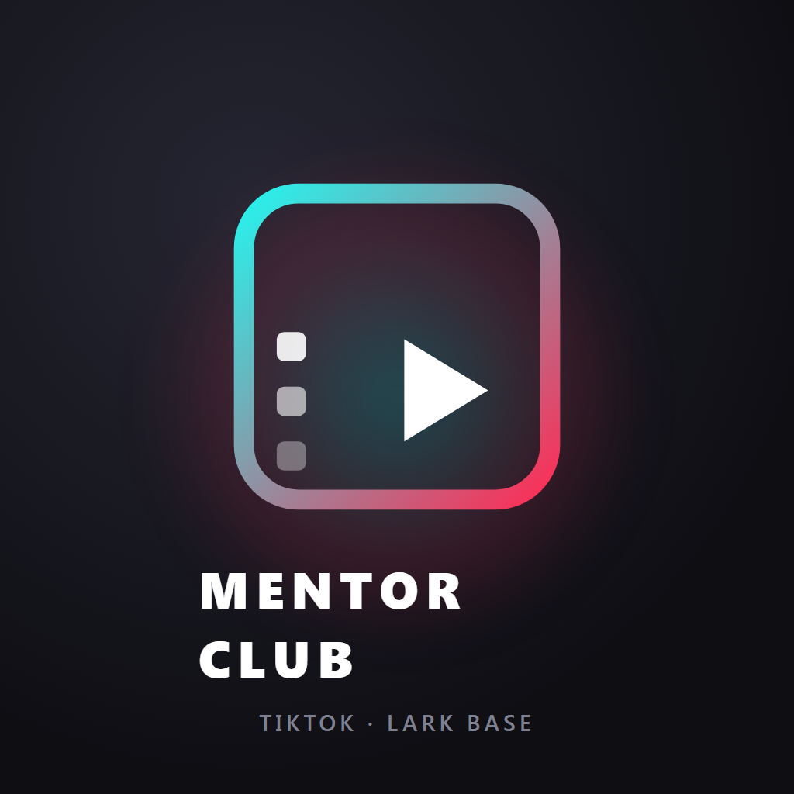

<p align="center">
  
</p>

<h1 align="center">TikTok ⇄ Lark Base</h1>

<p align="center">
  Kéo số liệu video &amp; profile TikTok về Lark Base — và đăng video từ Lark lên TikTok bằng một cú tick.<br>
  Chạy trên GitHub Actions: <b>không cần bật máy, không cần server.</b>
</p>

---

## Bộ này làm được gì

| | Chiều | Bảng Lark | Chạy khi nào |
|---|---|---|---|
| 📊 | **Kéo số liệu video** về (view, like, comment, share, caption, thumbnail) | `15.1 Data Tiktok` | Tự động **08:00 mỗi sáng** |
| 👤 | **Kéo profile** (follower, tổng like, số video, avatar, bio) | `15.3 Profile Tiktok` | Tự động **08:00 mỗi sáng** |
| 📤 | **Đăng video** từ Lark lên TikTok | `15.2 Đăng video TikTok` | Khi bạn **tick ô "Đăng ngay"** |

Chạy lại bao nhiêu lần cũng được: dữ liệu **cập nhật đè** lên dòng cũ (upsert theo `item_id` / `open_id`), **không bao giờ tạo dòng trùng**.

---

## ⚠️ Đọc 2 điều này trước, kẻo vỡ kỳ vọng

**1. Đăng video = vào HỘP THƯ, không tự lên tường.**
TikTok không cho phép app tự đăng công khai khi chưa qua kiểm duyệt của họ. Bộ này đẩy video vào **hộp thư/nháp** trong app TikTok của bạn → bạn mở điện thoại, dán caption, bấm Đăng. Caption cũng **không truyền qua API được** (cột "Caption gợi ý" chỉ để copy). Chi tiết + cách gỡ: [docs/06-gioi-han-va-loi.md](docs/06-gioi-han-va-loi.md)

**2. Tài khoản cá nhân chỉ có số liệu cơ bản.**
Các cột `average_time_watched`, `full_video_watched_rate`, `impression_sources_*`, `audience_countries-*` trong bảng 15.1 sẽ **luôn trống** — TikTok chỉ trả những số này cho tài khoản **Business**. Bảng vẫn tạo sẵn cột để sau nâng cấp không phải sửa.

---

## Triển khai — 7 bước

Người mới làm lần đầu mất khoảng **30–45 phút**, phần lớn là chờ TikTok/Lark duyệt thao tác bấm nút.

| # | Việc | Hướng dẫn |
|---|---|---|
| 1 | Tạo **app Lark** + cấp quyền + thêm app vào Base | [docs/01-tao-app-lark.md](docs/01-tao-app-lark.md) |
| 2 | Tạo **app TikTok** (có sẵn icon 1024×1024 để tải) | [docs/02-tao-app-tiktok.md](docs/02-tao-app-tiktok.md) |
| 3 | Base bật **Quyền nâng cao**? → xử lý riêng | [docs/03-quyen-nang-cao-lark.md](docs/03-quyen-nang-cao-lark.md) |
| 4 | **Tạo 3 bảng** tự động + lấy `refresh token` | [docs/04-tao-bang-va-token.md](docs/04-tao-bang-va-token.md) |
| 5 | Nạp **Secrets/Variables** lên GitHub | [docs/05-github-secrets.md](docs/05-github-secrets.md) |
| 6 | Nối **nút bấm & lịch tự động** trong Lark Base | [docs/07-lark-automation.md](docs/07-lark-automation.md) |
| 7 | Gặp lỗi? → tra bảng lỗi | [docs/06-gioi-han-va-loi.md](docs/06-gioi-han-va-loi.md) |

> 🩺 **Kẹt ở đâu cũng chạy lệnh này trước** — nó tự dò 7 mắt xích và chỉ đúng chỗ sai:
> ```bash
> node .claude/skills/hmh-AIOS-sync-tiktok-lark/scripts/check-setup.mjs
> ```

---

## Chạy thử ngay trên máy (không cần GitHub)

```bash
# 1. Điền cấu hình
cp .claude/skills/hmh-AIOS-sync-tiktok-lark/scripts/config.example.json \
   .claude/skills/hmh-AIOS-sync-tiktok-lark/scripts/config.local.json

# 2. Tạo 3 bảng trong Base (in ra 3 table_id)
node .claude/skills/hmh-AIOS-sync-tiktok-lark/scripts/setup-tables.mjs

# 3. Ủy quyền TikTok (mở link, bấm Authorize, dán code lại)
node .claude/skills/hmh-AIOS-sync-tiktok-lark/scripts/get-tiktok-token.mjs auth
node .claude/skills/hmh-AIOS-sync-tiktok-lark/scripts/get-tiktok-token.mjs exchange "<code>"

# 4. Kiểm tra toàn bộ cấu hình
node .claude/skills/hmh-AIOS-sync-tiktok-lark/scripts/check-setup.mjs

# 5. Chạy thật
node .claude/skills/hmh-AIOS-sync-tiktok-lark/scripts/sync-profile-tiktok.mjs   # profile -> 15.3
node .claude/skills/hmh-AIOS-sync-tiktok-lark/scripts/sync-tiktok-lark.mjs      # video   -> 15.1
node .claude/skills/hmh-AIOS-dang-video-tiktok/scripts/post-video-tiktok.mjs    # đăng    <- 15.2
```

Cần **Node ≥ 18**. Toàn bộ script **zero-dependency** — không `npm install` gì cả.

---

## Gọi qua HTTP (cho Lark Automation / Postman / n8n)

```http
POST https://api.github.com/repos/<user>/<repo>/dispatches
Authorization: Bearer <GITHUB_PAT>
Accept: application/vnd.github+json
Content-Type: application/json
```

```jsonc
// Kéo dữ liệu về (profile + video)
{ "event_type": "sync-tiktok" }

// Đăng ĐÚNG 1 video (dùng cho nút bấm trên Lark Base)
{ "event_type": "dang-video-tiktok", "client_payload": { "record_id": "recXXXXXX" } }
```

Thành công = **HTTP 204** (không có body). Xem log ở tab **Actions** của repo.

Muốn 1 repo phục vụ **nhiều khách / nhiều base**? Truyền thêm `base_id`, `table_tiktok`, `table_post`, `table_profile` trong `client_payload` — nó ghi đè Variables mặc định, **không phải sửa code**.

---

## Bàn giao cho khách mới

1. Khách fork repo này (hoặc bạn tạo repo riêng cho họ).
2. Khách tự tạo app Lark + app TikTok của **chính họ** theo `docs/01` và `docs/02`.
3. Điền **Secrets/Variables riêng** của khách theo `docs/05` — **không sửa một dòng code nào**.
4. Chạy `setup-tables.mjs` để tạo 3 bảng trong Base của khách.

---

## Bảo mật

- `config.local.json` chứa App Secret + refresh token → **đã nằm trong `.gitignore`, tuyệt đối không commit**.
- Trên GitHub, mọi giá trị bí mật để ở **Secrets** (không phải Variables).
- Lỡ dán secret ra chỗ công khai (chat, screenshot) → **thu hồi và tạo lại ngay**, đừng chần chừ.
